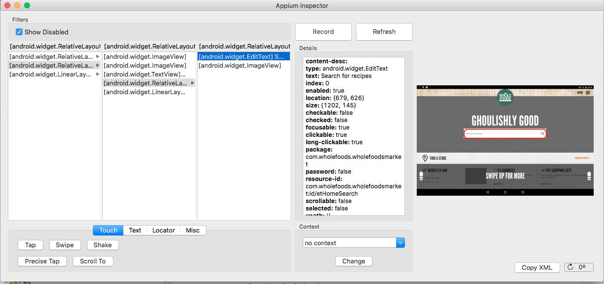
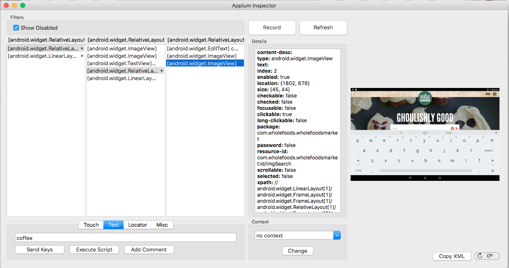
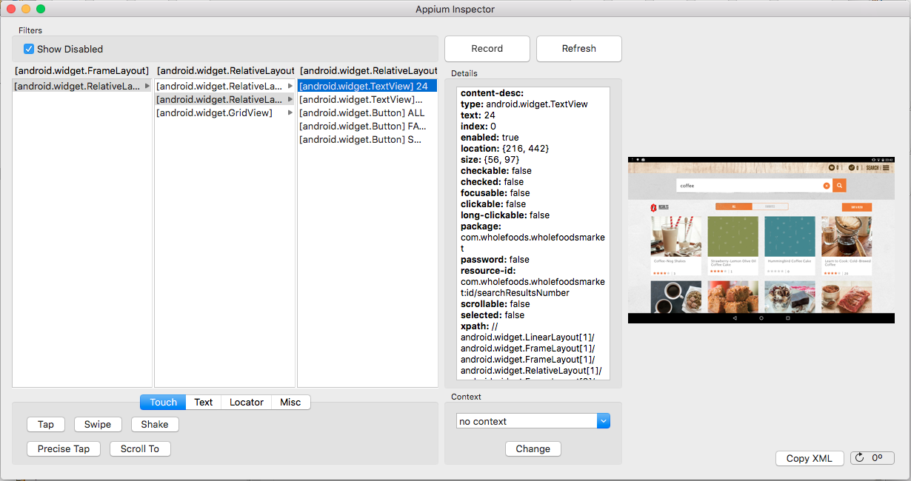
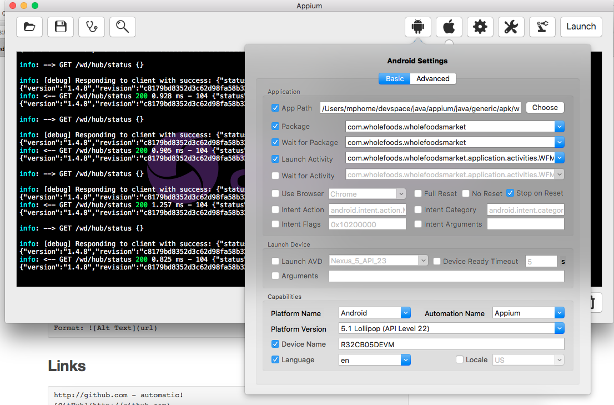

# applauseIt
Sample showing Applause api usage

## Introduction
1. We are going to test wholefoodsmarket app using appium. For this we are going to --
  * Enter "coffee" text in SearchBox 
  * Click Search Button 
  * Check count of  Result Text  is greater than zero

## How to use it :

1. Checkout repository in your <local> directory
2. Run Appium server with following 
3. Once the server is runnning, Goto the root of the (<local>) folder, compile and run tests using following command --
  ` mvn clean compile test -Dgroups=reg -Dbrowser=LOCAL_ANDROID_MOBILE -DtakeSnapShots=true -DappActivity=.application.activities.WFMSplashActivity -DappPackage=com.wholefoods.wholefoodsmarket  -DsnapshotDirectory=/Users/mphome/devspace/java/appium/applause`
3. If everything goes we should be able to see test results.

## Issues :

1. Exception is shown when the the app closes session.
